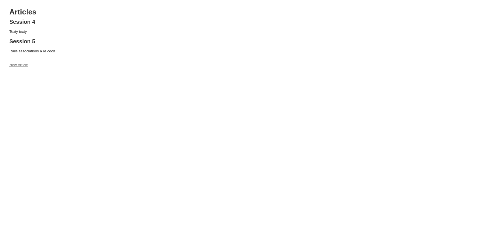

# Session 4 - Views

To wrap up the Award-Winning trilogy of abstraction layers, we take a
closer look at _View_ of the MVC architecture.

The _view_ layer is responsible for presenting data appropriately. In a
Rails application, the views are stored in `app/views` folder.

Each controller has their own views and the name of view file must match
the action name exactly. Depending on the action executed, the views are
used.

> Throughout the session, consider the views to be HTML-based unless
> specified otherwise.

- https://www.theodinproject.com/courses/ruby-on-rails/lessons/views

## Views as HTML Files

At a basic level, views are HTML files in which we insert information
from our controllers. As views are HTML files, anything that works in
HTML, CSS and Javascript works here.

- [HTML Tutorial](https://www.w3schools.com/html/default.asp)
- [Javascript Tutorial](https://www.w3schools.com/js/default.asp)

## Embedded Ruby

Embedded Ruby refers to pieces of code in between HTML code, to make the
views dynamic and extensible.

There are two ways of invoking ERB:
- `<%=` and `%>` wrap Ruby code whose return value will be output in
  place of marker.
- `<%` and `%>` wrap Ruby code whose return value will NOT be output.

```
# Displays current time
<p>Page generated at: <%= DateTime.now %></p>

# Does display not current time
<p>Page generated at: <% DateTime.now %></p>
```


The non-returning tag is used for iterating and preparing data:

```erb
<% @articles.each do |article| %>
  <tr>
    <td><%= article.title %></td>
    <td><%= article.content %></td>
    ...
  </tr>
<% end %>
```

The variables are shared between the controller and views using [instance
variables](https://www.rubyguides.com/2019/07/ruby-instance-variables/), that is variables prefixed by `@`:

```ruby
class ArticlesController < ApplicationController
  def index
    @articles = Article.all
  end
end
```

```erb
<% @articles.each do |article| %>
  <tr>
    <td><%= article.title %></td>
    <td><%= article.content %></td>
    ...
  </tr>
<% end %>
```

## Partials

When writing Ruby, we break up complex methods into multiple, smaller
methods. When writing views, we break up complex views into smaller
partials.

- The partials are named with the leading underscore and are in the same
  directory as the original view.
- You can pass variables to partials using `locals` keyword.


`app/views/articles/index.html.erb`:
```erb
<h1>Articles</h1>

<% @articles.each do |article| %>
  <%= render partial: "card", locals: {article: article} %>
<% end %>
```

`app/views/articles/_card.html.erb`:

```erb
<div>
  <h2><%= article.title %></h2>

  <p><%= article.content %></p>
</div>
```



- [View Partials](http://tutorials.jumpstartlab.com/topics/better_views/view_partials.html)

## Layouts

A layout defines the surrounding of an HTML page. It's the place to
decide a common look and feel of generated page.

If we take a look at HTML generated by `localhost:3000/articles`:

```html
<!DOCTYPE html>
<html>
  <head>
    <title>Blogspot</title>
    <meta name="viewport" content="width=device-width,initial-scale=1">
    <meta name="csrf-param" content="authenticity_token" />
    <meta name="csrf-token" content="9iJszH1WYV7RTAbOftTGlVETo027yYzcZ2B5bHelAu6QypMCMoquMEzFdfk_i9CgV1tZLluq7gBAFgHX_r_R_g" />


    <link rel="stylesheet" media="all" href="/assets/application.debug-56c72c26edc55c1b447e1442bf9c46e5d0f0ca6e85974ac24161c48b6a522f5f.css" />
  </head>

  <body>
    <p id="notice"></p>

    <h1>Articles</h1>

    <table>
      <thead>
        <tr>
          <th>Title</th>
          <th>Topic</th>
          <th>Tags</th>
          <th>Content</th>
          <th colspan="3"></th>
        </tr>
      </thead>

      <tbody>
          <tr>
            <td>Session 4</td>
            <td>Views</td>
            <td>Models</td>
            <td>Texty texty</td>
            <td><a href="/articles/1">Show</a></td>
            <td><a href="/articles/1/edit">Edit</a></td>
            <td><a data-confirm="Are you sure?" rel="nofollow" data-method="delete" href="/articles/1">Destroy</a></td>
          </tr>
      </tbody>
    </table>

    <br>

    <a href="/articles/new">New Article</a>

  </body>
</html>
```

However, we have added only the following in `app/views/articles/index.html.erb` view file:

```erb
<p id="notice"><%= notice %></p>

<h1>Articles</h1>

<table>
  <thead>
    <tr>
      <th>Title</th>
      <th>Topic</th>
      <th>Tags</th>
      <th>Content</th>
      <th colspan="3"></th>
    </tr>
  </thead>

  <tbody>
    <% @articles.each do |article| %>
      <tr>
        <td><%= article.title %></td>
        <td><%= article.topic %></td>
        <td><%= article.tags %></td>
        <td><%= article.content %></td>
        <td><%= link_to 'Show', article %></td>
        <td><%= link_to 'Edit', edit_article_path(article) %></td>
        <td><%= link_to 'Destroy', article, method: :delete, data:
        {confirm: 'Are you sure?' } %></td>
      </tr>
    <% end %>
  </tbody>
</table>

<br>

<%= link_to 'New Article', new_article_path %>
```

The remaining HTML is generated by `app/views/layouts/application.html.erb`:

```erb
<!DOCTYPE html>
<html>
  <head>
    <title>Blogspot</title>
    <meta name="viewport" content="width=device-width,initial-scale=1">
    <%= csrf_meta_tags %>
    <%= csp_meta_tag %>

    <%= stylesheet_link_tag 'application', media: 'all' %>
  </head>

  <body>
    <%= yield %>
  </body>
</html>
```

- [Ruby on Rails - Layouts](https://www.tutorialspoint.com/ruby-on-rails/rails-layouts.htm)

## Link Helper

Rails provides view helpers to generate HTML code using a simple,
ruby-like language.

For example, we can use:

```erb
<%= link_to 'Home', root_path %>
```

to generate a link to home page easily. We can also link to resources,
using the path helpers.

```erb
<%= link_to 'Delete', article, method: delete, data: { confirm: 'Are you sure? } %>
```

For reference, the named routes, path and HTTP verbs are related as
follows:

| Path | HTTP Verb | Controller#Action | Named Route | Used for |
| ---- | ----------------- | --------- | ----------- | -------- |
| /articles | GET | articles#index | articles_path | display all articles |
| /articles/new | GET | articles#new | new_article_path | return an HTML form for creating a new article |
| /articles | POST | articles#create | articles_path | create a new article |
| /articles/:id | GET | articles#show | article_path(@article) | display a specific article |
| /articles/:id/edit | GET | articles#edit | edit_article_path(@article) | return an HTML for editing an article |
| /articles/:id | PATCH/PUT | articles#update | update_article_path(@article) | update a specific article |
| /articles/:id | DELETE | articles#destroy | article_path(@article) | delete a specific article |

- [How to use link_to in Rails](https://mixandgo.com/learn/how-to-use-link_to-in-rails)

## Form Helper

We can write forms as well using view helpers as well.

```erb
<%= form_with(model: article) do |form| %>
  <div class="field">
    <%= form.label :title %>
    <%= form.text_field :title %>
  </div>

  <div class="field">
    <%= form.label :topic %>
    <%= form.text_field :topic %>
  </div>

  <div class="field">
    <%= form.label :tags %>
    <%= form.text_field :tags %>
  </div>

  <div class="field">
    <%= form.label :content %>
    <%= form.text_area :content %>
  </div>

  <div class="actions">
    <%= form.submit %>
  </div>
<% end %>
```

```html
<form action="/articles" accept-charset="UTF-8" method="post">
  <input type="hidden" name="authenticity_token" value="zCFC9p_L2J97AaNKU_frHWj6PFEUyHJyES5Rik8efNDfrzeX-oLBPGC8u0VlkhJdQlz6xT9OlBWnH2lcyJkOmQ" />

  <div class="field">
    <label for="article_title">Title</label>
    <input type="text" name="article[title]" id="article_title" />
  </div>

  <div class="field">
    <label for="article_topic">Topic</label>
    <input type="text" name="article[topic]" id="article_topic" />
  </div>

  <div class="field">
    <label for="article_tags">Tags</label>
    <input type="text" name="article[tags]" id="article_tags" />
  </div>

  <div class="field">
    <label for="article_content">Content</label>
    <textarea name="article[content]" id="article_content"></textarea>
  </div>

  <div class="actions">
    <input type="submit" name="commit" value="Create Article" data-disable-with="Create Article" />
  </div>
</form>
```

If we use a model, Rails automatically figures out which url to send
the form inputs to. Alternatively, we can also specify a url as:

```erb
<%= form_with url: search_path do |form| %>
  <%= form.label :query, "Search for:" %>
  <%= form.text_field :query %>
  <%= form.submit "Search" %>
<% end %>
```

Like `text_field` and `text_area`, Rails also has other helpers of interest:

```erb
<%= form.text_area :message, size: "70x5" %>
<%= form.hidden_field :parent_id, value: "foo" %>
<%= form.password_field :password %>
<%= form.number_field :price, in: 1.0..20.0, step: 0.5 %>
<%= form.range_field :discount, in: 1..100 %>
<%= form.date_field :born_on %>
<%= form.time_field :started_at %>
<%= form.datetime_local_field :graduation_day %>
<%= form.month_field :birthday_month %>
<%= form.week_field :birthday_week %>
<%= form.search_field :name %>
<%= form.email_field :address %>
<%= form.telephone_field :phone %>
<%= form.url_field :homepage %>
<%= form.color_field :favorite_color %>
```

> In practice, you should use third-party gems like
> [bootstrap_form](https://github.com/bootstrap-ruby/bootstrap_form)
> and [Simple Form](https://github.com/heartcombo/simple_form) as they
> are even easier to write.

- [Dealing with Model Objects](https://guides.rubyonrails.org/form_helpers.html#dealing-with-model-objects)
- [Understanding Parameter Naming Conventions](https://guides.rubyonrails.org/form_helpers.html#understanding-parameter-naming-conventions)

## Additional Topics

### Presenting other formats

Rails can present data in multiple ways, with different View file
formats using a `respond_to` block. These often require additional
third-party gems and libraries.

```rb
def index
  @aticles = Article.all

 respond_to do |format|
   format.html # renders index.html.erb
   format.json # renders index.json.jbuilder
 end
end
```

- [JBuilder](https://github.com/rails/jbuilder)
- [Generating PDFs with Rails](https://thoughtbot.com/upcase/videos/generating-pdfs-with-rails)
- [Ruby on Rails - Exporting Data to Excel](https://medium.com/@JasonCodes/ruby-on-rails-exporting-data-to-excel-b3b204281085)
